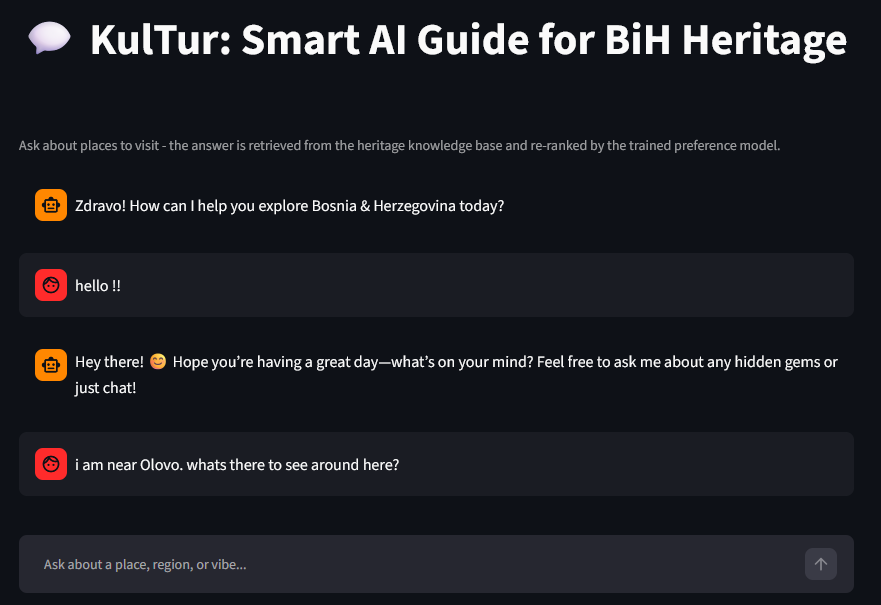
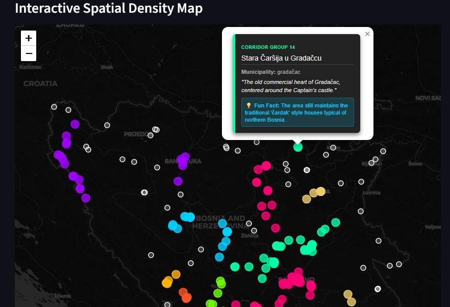
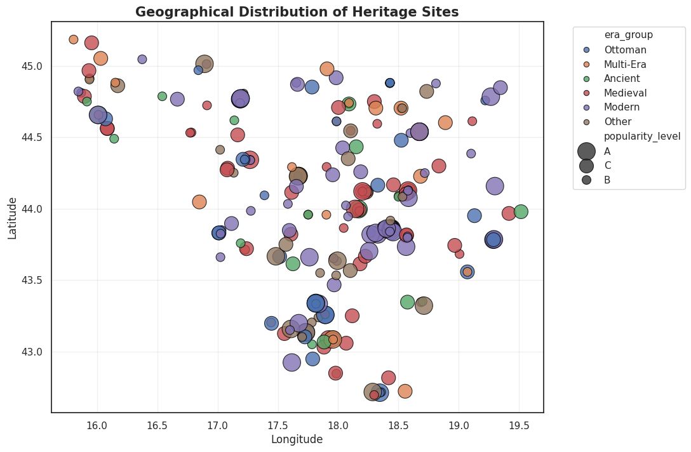

# KulTur: Smart AI Guide for BiH Heritage 🏰🇧🇦

[](https://www.kaggle.com/datasets/danakopi/bosnia-and-herzegovina-heritage-landmarks-dataset)
[](https://www.python.org/)
[](https://streamlit.io/)
[](LICENSE)

An intelligent, location-aware travel concierge for Bosnia & Herzegovina. **KulTur** combines **Retrieval-Augmented Generation (RAG)** grounded in a verified open-access cultural heritage database, enhanced by a **Random Forest preference re-ranker** and **DBSCAN spatial corridor clustering**.

---

##  Overview

Many cultural and historical landmarks in Bosnia and Herzegovina remain invisible online due to a lack of digital representation. As a result, tourists cluster around well-known hotspots like Mostar or Sarajevo's Baščaršija.

**KulTur** solves this cold-start discovery problem by acting as an AI guide restricted strictly to verified data:
1. **Semantic Search (ChromaDB + SentenceTransformers):** Retrieves top matching sites based on the query's topic.
2. **Supervised Re-Ranking (Random Forest):** Re-scores candidates according to real-time user context (season, region, time budget, specific interests).
3. **Grounded Generation (Groq / LLaMA-3):** Synthesizes conversational responses using *only* retrieved context to prevent AI hallucinations.
4. **Spatial Corridor Clustering (DBSCAN):** Identifies geographically clustered landmarks ($\varepsilon$-radius search) around target locations.

---

## Application Interface

| Conversational Assistant | Interactive Spatial Map |
| :---: | :---: |
|  |  |

---

##  Key Features

* **Grounded AI Assistant:** Delivers conversational recommendations strictly constrained to verified facts, distances, and landmarks.
* **Personalized Re-Ranking:** Uses a trained `RandomForestClassifier` (achieving **74.9% test accuracy** on unseen synthetic profiles) to prioritize contextually relevant places over generic popularity.
* **Fuzzy Alias Deduplication:** Implements a two-tiered fuzzy matching filter ($0.92$ threshold cutoff) to eliminate duplicate location recommendations (e.g., distinguishing *Travnik Fortress* from *Travnik Fortress (Stari Grad)*).
* **Location & Travel-Aware:** Dynamically adjusts recommendations when users mention target cities or travel constraints (e.g., limited time budgets).
* **Dual-View Interface:** Features a conversational chat interface alongside an interactive map view built with Streamlit and PyDeck/Folium.
* **Interactive Control Sidebar:** Allows users to dynamically tune DBSCAN spatial radius ($\varepsilon = 5 \text{ km}$ to $60 \text{ km}$), set minimum match confidence thresholds ($0.0 - 1.0$), and monitor active session state.

---

##  Dataset

The project relies on a manually curated and verified dataset of **273 heritage sites** across Bosnia and Herzegovina:
* **Source:** Compiled from institutional databases (Commission to Preserve National Monuments, UNESCO, Federal Institute for Statistics, Spomenik Database, public domain archives).
* **Fields:** 22 attributes per entry (Coordinates, 9 Standardized Categories, 6 Historical Eras, Region, Seasonality, Visit Duration, Popularity Score, Keywords).
* **Open Access:** Available publicly on [Kaggle Datasets](https://www.kaggle.com/datasets/danakopi/bosnia-and-herzegovina-heritage-landmarks-dataset).

### Geographic Distribution & Popularity


---

##  System Architecture

```text
User Query ──► Intent Routing & Context State
│
▼
Stage 1: ChromaDB Vector Search (Top-25 Candidates)
│
▼
Stage 2: Random Forest Supervised Re-Ranker
(Scores Interest, Season, Time, Region)
│
▼
Stage 3: Fuzzy Deduplication & DBSCAN Spatial Corridor Filter
│
▼
Stage 4: Grounded LLM Response Generation (Groq API)
